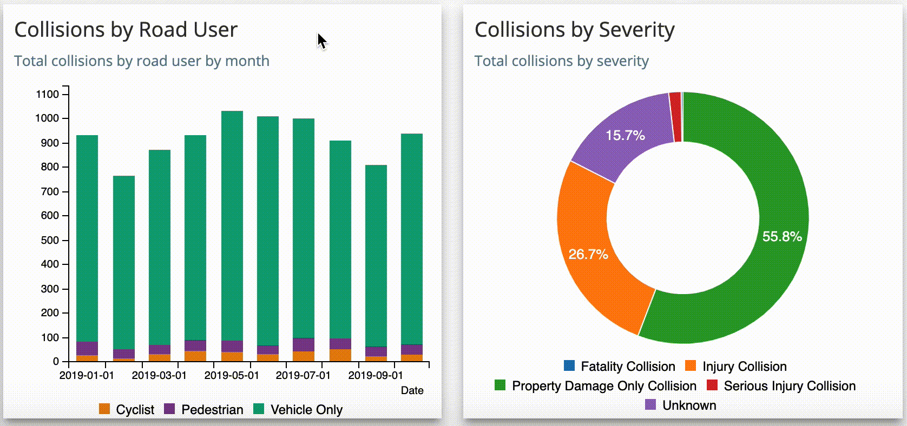
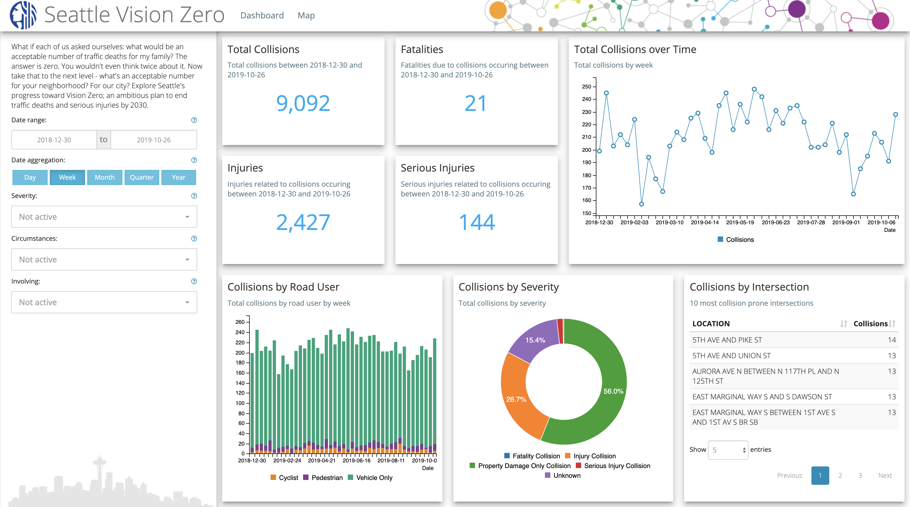

```{r setup, include = FALSE}
library(dplyr)
library(lubridate)
library(highcharter)
library(billboarder)
library(dygraphs)
library(DT)
library(leaflet)
library(streamgraph)
library(widgetframe)
```

layout: false
class: split-33 with-thick-border

.column.bg-main1[.content[
  # What is an interactive chart?
]]

.column[.content[
# 
  * Tooltips and labels triggered by clicking on or hovering over chart elements
  * Controls that enable or disable variables or fundamentally change how data is displayed
  * Controls that expand or highlight certain data elements of a visualization

.img-fill[]
]]

???

- TODO

<!-- ------------------------------------------------------------------------------------------- -->

---

layout: false
class: split-33 with-thick-border

.column.bg-main1[.content[
  # highcharter
]]

.column[.content[
# 
  * The R package `highcharter` is a wrapper for highcharts.js
  * Supports many chart types
  * Supports easy-to-read piping notation
  * highchart.js is free for non-commercial use
  * Excellent API reference: [.light-blue[api.highcharts.com/highcharts/]](https://api.highcharts.com/highcharts/)
```{r, echo = TRUE, eval = FALSE}
# install from CRAN
install.packages('highcharter')

# install development version from GitHub
devtools::install_github('jbkunst/highcharter')
```

.img-fill[]
]]

???

- TODO

<!-- ------------------------------------------------------------------------------------------- -->

---

layout: false
class: split-33 with-thick-border

.column.bg-main1[.content[
  # billboarder
]]

.column[.content[
# 
  * The R package `billboarder` is a wrapper for billboard.js
  * Supports many chart types
  * Supports easy-to-read piping notation
  * billboard.js is free and licensed under the MIT license
  * Excellent API reference: [.light-blue[naver.github.io/billboard.js/release/latest/doc/]](https://naver.github.io/billboard.js/release/latest/doc/)
```{r, echo = TRUE, eval = FALSE}
# install from CRAN
install.packages('billboarder')

# install development version from GitHub
devtools::install_github('dreamRs/billboarder')
```

.img-fill[]
]]

???

- TODO

<!-- ------------------------------------------------------------------------------------------- -->

---

layout: false
class: split-33 with-thick-border

.column.bg-main1[.content[
  # Data
]]

.column[.content[
# 
  * Seattle collision data from 2004 to present
```{r, echo = TRUE, cache = TRUE, message = FALSE}
src = 'https://opendata.arcgis.com/datasets/5b5c745e0f1f48e7a53acec63a0022ab_0.csv'
x = readr::read_csv(src) %>%
  filter(INCDATE >= '2004-01-01', INCDATE <= '2019-10-31')
x
```
]]

???

- We'll get some data from the City of Seattle's open data web portal. This link is a data set of
  collisions since 2004.
- We have information like latitude and longitude, the closest intersection, the collision severity 
  (i.e., injuries or fatalities), weather, road and lighting conditions, number of vehicles, 
  cyclist or pedestrians involved, etc.

<!-- OTHER CHARTS ------------------------------------------------------------------------------ -->

---

class: split-70 hide-slide-number
background-image: url('images/leaves.jpg')
background-size: cover

.column.slide-in-left[
.sliderbox.vmiddle.shade_main.center.content[
  # Common charts]]
.column[
]

<!-- ------------------------------------------------------------------------------------------- -->

---

layout: false
class: split-33 with-thick-border

.column.bg-main1[.content[
  # Time series
]]

.column[.content[
# 
  * Time series charts are good for understanding trends for one or more variables over time
  * There are several libraries that plot time-series data well including: `highcharter` and `billboarder`
  * Use `highcharter::hchart()` similar to `ggplot2::qplot()`
  * Use `highcharter::hcaes()` much like `ggplot2::aes()`
```{r, echo = TRUE, eval = FALSE}
y = x %>%
  group_by(INCMONTH = floor_date(ymd(INCDATE), unit = 'month')) %>%
  summarise(CNT = n())
hchart(y, type = 'line', hcaes(x = INCMONTH, y = CNT), name = 'Collisions',
       color = '#669900')
```

```{r, echo = FALSE, eval = TRUE, warning = FALSE}
y = x %>%
  group_by(INCMONTH = floor_date(ymd(INCDATE), unit = 'month')) %>%
  summarise(CNT = n())
h = hchart(y, type = 'line', hcaes(x = INCMONTH, y = CNT), name = 'Collisions',
           color = '#669900')
frameWidget(h, height = 250)
```
]]

???

- TODO
  
<!-- ------------------------------------------------------------------------------------------- -->

---

layout: false
class: split-33 with-thick-border

.column.bg-main1[.content[
  # Time series
]]

.column[.content[
# 
  * Build a highchart layer by layer with `highcharter::highchart()` and `highcharter::hc_add_series()`
```{r, echo = TRUE, eval = FALSE}
z = y %>% mutate(MA = zoo::rollmean(CNT, k = 2, fill = NA, align = 'right'))
highchart() %>% hc_xAxis(type = 'datetime') %>% 
  hc_add_series(type = 'line', data = z, hcaes(x = INCMONTH, y = CNT), name = 'Collisions',
                color = '#669900') %>% 
  hc_add_series(type = 'spline', data = z, hcaes(x = INCMONTH, y = MA),
                name = 'Moving Average', color = '#333333')
```

```{r, echo = FALSE, eval = TRUE, warning = FALSE}
z = y %>% mutate(MA = zoo::rollmean(CNT, k = 2, fill = NA, align = 'right'))
h = highchart() %>% hc_xAxis(type = 'datetime') %>% 
  hc_add_series(type = 'line', data = z, hcaes(x = INCMONTH, y = CNT), name = 'Collisions',
                color = '#669900') %>% 
  hc_add_series(type = 'spline', data = z, hcaes(x = INCMONTH, y = MA),
                name = 'Moving Average', color = '#333333')
frameWidget(h, height = 350)
```
]]

???

- TODO

<!-- ------------------------------------------------------------------------------------------- -->

---

layout: false
class: split-33 with-thick-border

.column.bg-main1[.content[
  # Time series
]]

.column[.content[
# 
```{r, echo = TRUE, eval = FALSE}
billboarder() %>% bb_linechart(data = y) %>% 
  bb_x_axis(tick = list(format = '%b %Y', fit = TRUE)) %>% 
  bb_subchart(show = T, size = list(height = 30), axis = list(x = list(show = F))) %>% 
  bb_legend(show = FALSE)
```

```{r, echo = FALSE, eval = TRUE}
billboarder(height = 200, width = '100%') %>% bb_linechart(data = y) %>% 
  bb_x_axis(tick = list(format = '%b %Y', fit = TRUE)) %>% 
  bb_subchart(show = TRUE, size = list(height = 30), axis = list(x = list(show = FALSE))) %>% 
  bb_legend(show = FALSE)
```

```{r, echo = TRUE, eval = FALSE}
y = xts::xts(x = y$CNT, order.by = y$INCMONTH)
hchart(y, name = 'Collisions')
```

```{r, echo = FALSE, eval = TRUE}
y = xts::xts(x = y$CNT, order.by = y$INCMONTH)
h = hchart(y, name = 'Collisions')
frameWidget(h, height = 200)
```
]]

???

- TODO
  
<!-- ------------------------------------------------------------------------------------------- -->

---

layout: false
class: split-33 with-thick-border

.column.bg-main1[.content[
  # Scatter
]]

.column[.content[
# 
  * Data from the CDC 500 Cities project
  * We can use `highcharter::hchart(type = 'scatter', ...)` to create a scatter chart
```{r, echo = TRUE, eval = FALSE}
load('data/cdc500cities.Rdata')
cdc = cdc %>% mutate(Location = paste0(PlaceName, ', ', StateAbbr))
hchart(cdc, type = 'scatter',
       hcaes(x = DIABETES_AdjPrev, y = OBESITY_AdjPrev, group = Location)) %>%
  hc_legend(enabled = FALSE)
```

```{r, echo = FALSE, eval = TRUE, message = FALSE}
library(sf)
load('data/cdc500cities.Rdata')
cdc = cdc %>% mutate(Location = paste0(PlaceName, ', ', StateAbbr))
h = hchart(cdc, type = 'scatter',
           hcaes(x = DIABETES_AdjPrev, y = OBESITY_AdjPrev, group = Location)) %>%
  hc_legend(enabled = FALSE)
frameWidget(h, height = 350)
```
]]

???

- The collisions dataset I downloaded was not really great for showing a scatter chart in action, 
  so I happened to have this CDC 500 Cities project data on hand. CDC 500 Cities project is a 
  study of health outcomes in 500 U.S. cities.
- Along with x-axis I have the prevalence of diabetes, and along the y-axis I have the prevalence of
  obesity. Each dot in this chart is a city. It's no surprise there is a strong relationship beween 
  diabetes and obesity.
- We can pick out some extreme values in our scatter chart. For example, in the far upper-right we 
  have Gary, IN and in the lower-left we see Boulder, CO.

<!-- ------------------------------------------------------------------------------------------- -->

---

layout: false
class: split-33 with-thick-border

.column.bg-main1[.content[
  # Bar
]]

.column[.content[
# 
  * Bar charts are great at showing the relationship between categories and numbers
  * Use `highcharter::hchart(type = 'column', ...)` to create a bar chart
  * Use the `group` parameter in `highcharter::hcaes()` to add a grouping
```{r, echo = TRUE, eval = FALSE}
y = x %>% filter(COLLISIONTYPE %in% c('Pedestrian', 'Cycles')) %>% 
  group_by(INCYEAR = year(INCDATE), COLLISIONTYPE) %>%
  summarise(CNT = n())
hchart(y, type = 'column', hcaes(x = INCYEAR, y = CNT, group = COLLISIONTYPE))
```

```{r, echo = FALSE, eval = TRUE}
y = x %>% filter(COLLISIONTYPE %in% c('Pedestrian', 'Cycles')) %>% 
  group_by(INCYEAR = year(INCDATE), COLLISIONTYPE) %>%
  summarise(CNT = n())
h = hchart(y, type = 'column', hcaes(x = INCYEAR, y = CNT, group = COLLISIONTYPE))
frameWidget(h, height = 300)
```
]]

???

- TODO

<!-- ------------------------------------------------------------------------------------------- -->

---

layout: false
class: split-33 with-thick-border

.column.bg-main1[.content[
  # Bar
]]

.column[.content[
# 
  * With `billboarder::bb_barchart()` it's easy to create a stacked bar chart
  * Use `reshape2::dcast()` to pivot the data
  * Use `billboarder::bb_color()` or `billboarder::bb_color_manual()` to control colors
```{r, echo = TRUE, eval = FALSE}
y = x %>%
  group_by(INCYEAR = year(INCDATE), SEVERITYDESC) %>%
  summarise(CNT = n()) %>% reshape2::dcast(INCYEAR~SEVERITYDESC)
billboarder() %>% bb_barchart(data = y, stacked = T) %>% 
  bb_color(palette = c('#E58606','#5D69B1','#52BCA3','#99C945','#CC61B0'))
```

```{r, echo = FALSE, eval = TRUE, warning = FALSE}
y = x %>%
  group_by(INCYEAR = year(INCDATE), SEVERITYDESC) %>%
  summarise(CNT = n()) %>% reshape2::dcast(INCYEAR~SEVERITYDESC, value.var = 'CNT')
billboarder(height = 250, width = '100%') %>% bb_barchart(data = y, stacked = T) %>% 
  bb_color(palette = c('#E58606','#5D69B1','#52BCA3','#99C945','#CC61B0'))
```
]]

???

- TODO

<!-- ------------------------------------------------------------------------------------------- -->

---

layout: false
class: split-33 with-thick-border

.column.bg-main1[.content[
  # Pie or donut
]]

.column[.content[
# 
  * Pie or donut charts are not as bad as some people would have you believe
  * Use `billboarder::bb_piechart()` to create a pie chart
  * Change legend position with `billboarder::bb_legend()`
```{r, echo = TRUE, eval = FALSE}
y = x %>% filter(COLLISIONTYPE %in% c('Pedestrian', 'Cycles')) %>% 
  group_by(SEVERITYDESC) %>% 
  summarise(CNT = n())
billboarder() %>% bb_piechart(y) %>% bb_legend(position = 'right')
```

```{r, echo = FALSE, eval = TRUE}
y = x %>% filter(COLLISIONTYPE %in% c('Pedestrian', 'Cycles')) %>% 
  group_by(SEVERITYDESC) %>% 
  summarise(CNT = n())
billboarder(height = 300) %>% bb_piechart(y) %>% bb_legend(position = 'right')
```
]]

???

- TODO

<!-- ------------------------------------------------------------------------------------------- -->

---

layout: false
class: split-33 with-thick-border

.column.bg-main1[.content[
  # Pie or donut
]]

.column[.content[
# 
  * If you or your audience has an aversion to pie charts, consider using a donut chart
  * Use `billboarder::bb_donutchart()` to create a donut chart
```{r, echo = TRUE, eval = FALSE}
billboarder() %>% bb_donutchart(y) %>% bb_legend(position = 'right')
```

```{r, echo = FALSE, eval = TRUE}
billboarder(height = 350) %>% bb_donutchart(y) %>% bb_legend(position = 'right')
```
]]

???

- TODO

<!-- ADVANCED CHARTS --------------------------------------------------------------------------- -->

---

class: split-70 hide-slide-number
background-image: url('images/leaves.jpg')
background-size: cover

.column.slide-in-left[
.sliderbox.vmiddle.shade_main.center.content[
  # Advanced charts]]
.column[
]

<!-- ------------------------------------------------------------------------------------------- -->

---

layout: false
class: split-33 with-thick-border

.column.bg-main1[.content[
  # Histograms and density
]]

.column[.content[
# 
  * A histogram can be used to understand the distribution of data
  * Use `highcharter::hchart(type = 'histogram', ...)` to make a histogram
```{r, echo = TRUE, eval = FALSE}
y = x %>% group_by(INCDATE) %>% summarise(CNT = n())
hchart(y$CNT, type = 'histogram', name = 'Daily Collisions', color = '#669900')
```

```{r, echo = FALSE, eval = TRUE}
y = x %>% group_by(INCDATE) %>% summarise(CNT = n())
h = hchart(y$CNT, type = 'histogram', name = 'Daily Collisions', color = '#669900')
frameWidget(h, height = 150)
```

```{r, echo = TRUE, eval = FALSE}
hchart(hist(y$CNT, breaks = 30, plot = F), type = 'histogram', name = 'Daily Collisions',
       color = '#669900')
```

```{r, echo = FALSE, eval = TRUE}
h = hchart(hist(y$CNT, breaks = 30, plot = F), type = 'histogram', name = 'Daily Collisions',
           color = '#669900')
frameWidget(h, height = 150)
```
]]

???

- TODO

<!-- ------------------------------------------------------------------------------------------- -->

---

layout: false
class: split-33 with-thick-border

.column.bg-main1[.content[
  # Histograms and density
]]

.column[.content[
# 
  * To create a density plot, apply `stats::density()` to the data and use `type = 'area'` in the `billboarder::hchart()` function
```{r, echo = TRUE, eval = FALSE}
hchart(density(y$CNT), type = 'area', name = 'Daily Collisions', color = '#669900')
```

```{r, echo = FALSE, eval = TRUE}
h = hchart(density(y$CNT), type = 'area', name = 'Daily Collisions', color = '#669900')
frameWidget(h, height = 400)
```
]]

???

- TODO

<!-- ------------------------------------------------------------------------------------------- -->

---

layout: false
class: split-33 with-thick-border

.column.bg-main1[.content[
  # Boxplots
]]

.column[.content[
# 
  * Boxplots are useful for understanding distributions in data
  * The shortcut `highcharter::hcboxplot` automatically provides a tooltip displaying distribution characteristics
```{r, echo = TRUE, eval = FALSE}
y = x %>% mutate(INCMONTH = month(INCDATE, label = T), INCYEAR = year(INCDATE)) %>% 
  group_by(INCYEAR, INCMONTH) %>% summarise(CNT = n())
hcboxplot(x = y$CNT, var = y$INCMONTH, outliers = F, name = 'Boxplot', color = '#669900')
```

```{r, echo = FALSE, eval = TRUE, warning = FALSE}
y = x %>% mutate(INCMONTH = month(INCDATE, label = TRUE), INCYEAR = year(INCDATE)) %>% 
  group_by(INCYEAR, INCMONTH) %>% summarise(CNT = n())
h = hcboxplot(x = y$CNT, var = y$INCMONTH, outliers = FALSE, name = 'Boxplot', color = '#669900')
frameWidget(h, height = 350)
```
]]

???

- A boxplot is not as common of a visualization and can be confusing for audiences that are not 
  familiar with statistics.

<!-- ------------------------------------------------------------------------------------------- -->

---

layout: false
class: split-33 with-thick-border

.column.bg-main1[.content[
  # Boxplots
]]

.column[.content[
# 
  * Consider adding a scatter plot of the underlying data
```{r, echo = TRUE, eval = FALSE}
y = x %>% mutate(INCMONTH = month(INCDATE, label = T), INCYEAR = year(INCDATE)) %>% 
  group_by(INCYEAR, INCMONTH) %>% summarise(CNT = n())
hcboxplot(x = y$CNT, var = y$INCMONTH, outliers = F, name = 'Boxplot', color = '#669900') %>% 
    hc_add_series(y, 'scatter', color = '#66990060',
                  hcaes(x = INCMONTH, y = CNT, group = INCYEAR),
                  tooltip = list(pointFormat = '<b>{point.y}</b><br/>'),
                  marker = list(radius = 3))
```

```{r, echo = FALSE, eval = TRUE, warning = FALSE}
y = x %>% mutate(INCMONTH = month(INCDATE, label = TRUE), INCYEAR = year(INCDATE)) %>% 
        group_by(INCYEAR, INCMONTH) %>% summarise(CNT = n())
h = hcboxplot(x = y$CNT, var = y$INCMONTH, outliers = FALSE, name = 'Boxplot', color = '#669900') %>% 
    hc_add_series(y, 'scatter', color = '#66990060',
                  hcaes(x = INCMONTH, y = CNT, group = INCYEAR),
                  tooltip = list(pointFormat = '<b>{point.y}</b><br/>'),
                  marker = list(radius = 3))
frameWidget(h, height = 350)
```
]]

???

- Assuming our data doesn't have too many points, we can add a scatter plot to our boxplot to get a 
  more detailed view of the data.

<!-- ------------------------------------------------------------------------------------------- -->

---

layout: false
class: split-33 with-thick-border

.column.bg-main1[.content[
  # Heatmaps
]]

.column[.content[
# 
  * A heatmap displays values in a matrix represented as colors
  * We can use `highcharter::hchart(type = 'heatmap', ...)` to create a heatmap
```{r, echo = TRUE, eval = FALSE}
y = x %>% 
  mutate(INCDTTM = parse_date_time(INCDTTM, orders = c('%m/%d/%Y %H:%M:%S %p'),
                                   tz = 'America/Los_Angeles')) %>% 
  filter(!is.na(INCDTTM)) %>%
  mutate(INCHOUR = hour(INCDTTM), INCMONTH = month(INCDTTM, label = TRUE)) %>%
  group_by(INCHOUR, INCMONTH) %>% 
  summarize(CNT = n())
hchart(y, 'heatmap', hcaes(x = INCHOUR, y = INCMONTH, value = CNT))
```

```{r, echo = FALSE, eval = TRUE, warning = FALSE}
y = x %>%
  mutate(INCDTTM = parse_date_time(INCDTTM, orders = c('%m/%d/%Y %H:%M:%S %p'),
                                   tz = 'America/Los_Angeles')) %>% 
  filter(!is.na(INCDTTM)) %>%
  mutate(INCHOUR = hour(INCDTTM), INCMONTH = month(INCDTTM, label = TRUE)) %>%
  group_by(INCHOUR, INCMONTH) %>% 
  summarize(CNT = n())
h = hchart(y, 'heatmap', hcaes(x = INCHOUR, y = INCMONTH, value = CNT))
frameWidget(h, height = 350)
```
]]

???

- In this visualization, I've created a matrix. Along the y-axis I have the month and along the 
  x-axis I have the time of day. Each cell shows the number of collisions that have occured during 
  each hour of the month.
- I think this visualization is okay. Let's see what we can do to spice up this heatmap.
  
<!-- ------------------------------------------------------------------------------------------- -->

---

layout: false
class: split-33 with-thick-border

.column.bg-main1[.content[
  # Heatmaps
]]

.column[.content[
# 
  * Use a short Javascript snippet to format the tooltip
  * Using `hc_colorAxis` we can modify the color pallete
```{r, echo = TRUE, eval = FALSE}
tooltip_formatter = JS("function() {
    return this.point.x + ':00 ' +  this.series.yAxis.categories[this.point.y] + '<br>' +
    this.point.value.toLocaleString();
}")

hchart(y, 'heatmap', hcaes(x = INCHOUR, y = INCMONTH, value = CNT)) %>% 
  hc_colorAxis(stops = color_stops(10, rev(viridis::magma(10)))) %>% 
  hc_xAxis(categories = paste0(0:23, ':00')) %>% 
  hc_yAxis(reversed = TRUE) %>% 
  hc_tooltip(formatter = tooltip_formatter) %>% 
  hc_legend(layout = 'vertical', verticalAlign = 'top', align = 'right')
```

```{r, echo = FALSE, eval = TRUE, warning = FALSE}
tooltip_formatter = JS("function() {
    return this.point.x + ':00 ' +  this.series.yAxis.categories[this.point.y] + '<br>' +
    this.point.value.toLocaleString();
}")

h = hchart(y, 'heatmap', hcaes(x = INCHOUR, y = INCMONTH, value = CNT)) %>% 
  hc_colorAxis(stops = color_stops(10, rev(viridis::magma(10)))) %>% 
  hc_xAxis(categories = paste0(0:23, ':00')) %>% 
  hc_yAxis(reversed = TRUE) %>% 
  hc_tooltip(formatter = tooltip_formatter) %>% 
  hc_legend(layout = 'vertical', verticalAlign = 'top', align = 'right')
frameWidget(h, height = 300)
```
]]

???

- With a few extra lines of code, our heatmap became a much more engaging visualization. Here we 
  are leveraging the viridis package to create a really nice gradient palette.
- We cleaned up some of the formatting on the x-axis for time of day. I moved to legend to the 
  right of the graphic and I've copied a Javascript snippet from a blogpost to make a more legible 
  tooltip.

<!-- ------------------------------------------------------------------------------------------- -->

---

layout: false
class: split-33 with-thick-border

.column.bg-main1[.content[
  # Tables
]]

.column[.content[
# 
  * Tables can be interesting with the `DT` package, a wrapper for the DataTables jQuery plug-in
  * Use `DT::datatable()`
```{r, echo = TRUE, eval = TRUE}
y = x %>% mutate(Year = year(INCDATE)) %>% 
  group_by(Year) %>%
  summarize(Injuries = sum(SEVERITYDESC == 'Injury Collision'),
            `Serious Injuries` = sum(SEVERITYDESC == 'Serious Injury Collision'),
            Fatalities = sum(SEVERITYDESC == 'Fatality Collision'))
datatable(y, rownames = FALSE, options = list(pageLength = 5, scrollY = '200px'))
```
]]

???

- Tables don't have to be boring!

<!-- ------------------------------------------------------------------------------------------- -->

---

layout: false
class: split-33 with-thick-border

.column.bg-main1[.content[
  # Tables
]]

.column[.content[
# 
  * Style tables columns with `DT::formatStyle()`
```{r, echo = TRUE, eval = TRUE}
breaks = quantile(y$Fatalities, probs = seq(.05, .95, .05), na.rm = TRUE)
cols = viridis::magma(length(breaks) + 1, begin = 0.5, direction = -1)
datatable(y, rownames = FALSE, class = 'compact stripe',
          options = list(pageLength = 10)) %>%
  formatStyle('Fatalities', backgroundColor = styleInterval(breaks, cols))
```
]]

???

- Here we are applying some conditional formatting on the "Fatalities" column. Once again, I make 
  use of the viridis package for a nice gradient color palette.

<!-- OTHER CHARTS ------------------------------------------------------------------------------ -->

---

class: split-70 hide-slide-number
background-image: url('images/leaves.jpg')
background-size: cover

.column.slide-in-left[
.sliderbox.vmiddle.shade_main.center.content[
  # Other charts]]
.column[
]

<!-- ------------------------------------------------------------------------------------------- -->

---

layout: false
class: split-33 with-thick-border

.column.bg-main1[.content[
  # Streamgraph
]]

.column[.content[
# 
  * A streamgraph is, roughly speaking, a stacked area chart
  * While a streamgraph is not the most accurate way to represent data, it can make for a compelling visulization
```{r, echo = TRUE, eval = FALSE}
# install from GitHub
devtools::install_github('hrbrmstr/streamgraph')
```

```{r, echo = TRUE, eval = FALSE}
cols = c('#40004b', '#762a83', '#9970ab', '#c2a5cf', '#e7d4e8',
         '#d9f0d3', '#a6dba0', '#5aae61', '#1b7837', '#00441b')
streamgraph(data = y, key = LOCATION, value = CNT, date = INCDATE) %>%
  sg_axis_x(tick_units = 'year', tick_format = '%Y') %>%
  sg_fill_manual(values = cols)
```

```{r, echo = FALSE, eval = TRUE}
# most dangerous intersections
danger = x %>% filter(INCDATE >= '2004-01-01', INCDATE <= '2018-12-31') %>%
  filter(!is.na(LOCATION), SEVERITYDESC %in% c('Fatality Collision', 'Serious Injury Collision', 'Injury Collision')) %>% 
  group_by(LOCATION) %>% summarise(CNT = n()) %>% top_n(10, CNT)
y =  x %>% filter(INCDATE >= '2004-01-01', INCDATE <= '2018-12-31', LOCATION %in% danger$LOCATION) %>%
  group_by(INCDATE = floor_date(ymd(INCDATE), unit = 'year'), LOCATION) %>%
  summarize(CNT = n())
cols = c('#40004b', '#762a83', '#9970ab', '#c2a5cf', '#e7d4e8',
         '#d9f0d3', '#a6dba0', '#5aae61', '#1b7837', '#00441b')
sg = streamgraph(data = y, key = LOCATION, value = CNT, date = INCDATE) %>%
  sg_axis_x(tick_units = 'year', tick_format = '%Y') %>%
  sg_fill_manual(values = cols)
frameWidget(sg, height = 250)
```
]]

???

- A streamgraph is, roughly speaking, a stacked area chart with a varying central axis instead of 
  a fixed central axis.
- For this visualization, we have identified the 10 "most dangerous" intersections, which here I've 
  defined as intersections with the most injuries and fatalities. I have then summed the total 
  number of collisions for each year by intersection. The code I used to do this will be available 
  on Github.
- As we can see, the graph is kind of "wavy" and difficult to make a very quantitative assessment 
  of the data, but generally speaking, we can see an overall downward trend which is evident by the 
  gradual "narrowing" of the streamgraph.
- A streamgraph can be a neat visualization when we value aesthetics over legibility.

<!-- ------------------------------------------------------------------------------------------- -->

---

layout: false
class: split-33 with-thick-border

.column.bg-main1[.content[
  # Gauges
]]

.column[.content[
# 
  * Gauges are useful for visualizing trends toward a target
  * The `billboarder` package has good support for creating and customizing gauges with `billboarder::bb_gaugechart()`
```{r, echo = TRUE, eval = FALSE}
billboarder() %>% bb_gaugechart(value = 95)
```

```{r, echo = FALSE, eval = TRUE}
billboarder(height = 150, width = '100%') %>% bb_gaugechart(value = 95)
```

```{r, echo = TRUE, eval = FALSE}
billboarder() %>% bb_gaugechart(value = 25)
```

```{r, echo = FALSE, eval = TRUE}
billboarder(height = 150, width = '100%') %>% bb_gaugechart(value = 25)
```
]]

???

- TODO

<!-- ------------------------------------------------------------------------------------------- -->

---

layout: false
class: split-33 with-thick-border

.column.bg-main1[.content[
  # Map
]]

.column[.content[
# 
  * A map is the coolest way you can visualize your data
  * Check out the `leaflet` package
  * For more details about using leaflet see: [.light-blue[byollin.github.io/ShinyLeaflet/]](https://byollin.github.io/ShinyLeaflet/)
  
```{r, echo = TRUE, eval = FALSE}
y = sf::st_as_sf(filter(x, !is.na(X), !is.na(Y), INCDATE >= '2019-01-01'),
                 coords = c('X', 'Y'), crs = 4326)
leaflet() %>%
  addProviderTiles(providers$CartoDB.Positron) %>% 
  setView(lng = -122.330412, lat = 47.609056, zoom = 14) %>% 
  addCircleMarkers(data = y, fillColor = '#ff5c33', color = '#661400',
                   fillOpacity = 1, opacity = 1, radius = 3, weight = 2,
                   label = y$INCDATE, clusterOptions = markerClusterOptions())
```

```{r, echo = FALSE, eval = TRUE, warning = FALSE}
y = sf::st_as_sf(filter(x, !is.na(X), !is.na(Y), INCDATE >= '2019-01-01'),
                 coords = c('X', 'Y'), crs = 4326)
l = leaflet() %>%
  addProviderTiles(providers$CartoDB.Positron) %>% 
  setView(lng = -122.330412, lat = 47.609056, zoom = 14) %>% 
  addCircleMarkers(data = y, fillColor = '#ff5c33', color = '#661400',
                   fillOpacity = 1, opacity = 1, radius = 3, weight = 2,
                   label = y$INCDATE, clusterOptions = markerClusterOptions(showCoverageOnHover = FALSE))
frameWidget(l, height = 250)
```
]]

???

- In my humble opinion, a map is the absolute coolest way you can visualize your data.
- I could make a whole presentation on building leaflet maps with R, in fact, I have, so I won't 
  dwell too much here.
- In this example, we are looking at collisions that have occured in 2019. We have added marker 
  clusters to get a sense of where the majority of collisions are concentrated.

<!-- ------------------------------------------------------------------------------------------- -->

---

layout: false
class: split-33 with-thick-border

.column.bg-main1[.content[
  # Other
]]

.column[.content[
# 
  * Pass a `princomp` object to `highcharter::hchart()` to visualizes the results of PCA
```{r, echo = TRUE, eval = FALSE, message = FALSE}
load('data/cdc500cities.Rdata')
cdc = cdc %>% mutate(Location = paste0(PlaceName, ', ', StateAbbr)) %>% as_tibble() %>% 
  select(Location, ends_with('AdjPrev')) %>% select(-PAPTEST_AdjPrev)
cdc = data.frame(cdc[, 2:ncol(cdc)], row.names = cdc$Location)
pr = princomp(cdc, cor = TRUE)
hchart(pr)
```
  * See next slide!
]]

<!-- ------------------------------------------------------------------------------------------- -->

---

layout: false
class: split-33 with-thick-border

.column.bg-main1[.content[
  # Other
]]

.column[.content[
# 
```{r, echo = FALSE, eval = TRUE, message = FALSE}
library(sf)
load('data/cdc500cities.Rdata')
cdc = cdc %>% mutate(Location = paste0(PlaceName, ', ', StateAbbr)) %>% as_tibble() %>% 
  select(Location, ends_with('AdjPrev')) %>% select(-PAPTEST_AdjPrev)
cdc = data.frame(cdc[, 2:ncol(cdc)], row.names = cdc$Location)
names(cdc) = c('Limited healthcare access', 'Arthritis', 'Binge drinking', 'High blood pressure',
               'High blood pressure (taking medication)', 'Cancer', 'Asthma', 'Heart disease', 
               'Routine checkups', 'Cholesterol screening', 'Colon screening', 'COPD',
               'Preventative services (men)', 'Preventative services (women)', 'Smoking',
               'Dental visits', 'Diabetes', 'High cholesterol', 'Kidney disease',
               'Sedentary lifestyle', 'Mammograms', 'Mental illness', 'Obesity', 'Poor physical health',
               'Sleep disorder', 'Stroke', 'Teeth loss')
pr = princomp(cdc, cor = TRUE)
h = hchart(pr)
frameWidget(h, height = 650)
```
]]

<!-- INTERACTIVE CHARTS IN SHINY ---------------------------------------------------------------- -->

---

class: split-70 hide-slide-number
background-image: url('images/leaves.jpg')
background-size: cover

.column.slide-in-left[
.sliderbox.vmiddle.shade_main.center.content[
  # Interactive charts in Shiny]]
.column[
]

<!-- ------------------------------------------------------------------------------------------- -->

---

layout: false
class: split-33 with-thick-border

.column.bg-main1[.content[
  # Shiny integration
]]

.column[.content[
# 
  * In the UI code, include an output function (e.g., `billboarderOutput`, `highchartOutput`, etc.)
  * In the server code, build the visualization with a render function (e.g., `renderBillboarder`, `renderHighchart`, etc.)
  
```{r, echo = TRUE, eval = FALSE}
ui = fluidPage(
    titlePanel('Interactive Chart'),
    sidebarLayout(
        sidebarPanel(
            sliderInput('bins', label = 'Number of bins:',
                        min = 1, max = 100, value = 30)
        ),
        mainPanel(
            billboarderOutput('histogram')
        )
    )
)

server = function(input, output) {
    x = rnorm(1000)
    output$histogram = renderBillboarder({
        billboarder() %>% bb_histogram(data = data, bins = input$bins)
    })
}
  
shinyApp(ui, server)
```
]]

???

- This code is a very simple Shiny application that will adjust the number of bins in a histogram

<!-- INTERACTIVE CHARTS IN SHINY ---------------------------------------------------------------- -->

---

class: split-70 hide-slide-number
background-image: url('images/leaves.jpg')
background-size: cover

.column.slide-in-left[
.sliderbox.vmiddle.shade_main.center.content[
  # Live demo]]
.column[
]

<!-- ------------------------------------------------------------------------------------------- -->

---

layout: false
class: split-33 with-thick-border

.column.bg-main1[.content[
  # Vision Zero Dashboard
]]

.column[
# 
  * Vision Zero is an ambitious plan to end traffic related deaths and serious injuries by 2030
  * The Vision Zero Dashboard [.light-blue[byollin.shinyapps.io/VisionZero]](https://byollin.shinyapps.io/VisionZero/) is an interactive tool to track progress towards this goal
  
.img-fill[]
]

<!-- ------------------------------------------------------------------------------------------- -->

---

class: bg-main2 

# Resources
  * Higcharter package documentation and demos: [.yellow[jkunst.com/highcharter/index.html]](http://jkunst.com/highcharter/index.html)
  * highcharts.js API reference: [.yellow[api.highcharts.com/highcharts/]](https://api.highcharts.com/highcharts/)
  * Billboarder package documentation and demos: [.yellow[dreamrs.github.io/billboarder/articles/billboarder.html]](https://dreamrs.github.io/billboarder/articles/billboarder.html)
  * billboard.js API reference: [.yellow[naver.github.io/billboard.js/release/latest/doc/]](https://naver.github.io/billboard.js/release/latest/doc/)
  * Dygraphs package documentation and demos: [.yellow[rstudio.github.io/dygraphs/]](https://rstudio.github.io/dygraphs/)
  * DT package documentation and demos: [.yellow[rstudio.github.io/DT/]](https://rstudio.github.io/DT/)
  * Leaflet package documentation and demos: [.yellow[rstudio.github.io/leaflet/]](https://rstudio.github.io/leaflet/)

<!-- ------------------------------------------------------------------------------------------- -->

---

class: bg-main2 

# Thank you!
  * Find the source code for this presentation here: `r anicon::faa("github", animate = 'shake', anitype = 'hover')` [.yellow[github.com/byollin/RInteractiveCharts]](https://github.com/byollin/RInteractiveCharts)
  * The slides can be accessed here: `r anicon::faa("github", animate = 'shake', anitype = 'hover')` [.yellow[byollin.github.io/RInteractiveCharts/]](http://byollin.github.io/RInteractiveCharts/)
  * The source code for the Vision Zero dashboard here: `r anicon::faa("github", animate = 'shake', anitype = 'hover')` [.yellow[github.com/byollin/RInteractiveCharts/tree/master/collisions_dashboard]](https://github.com/byollin/RInteractiveCharts/tree/master/collisions_dashboard)
  * Please feel free to reach out or connect on LinkedIn!
  
--

<br><br>

.content.center[
  `r anicon::faa('question', animate = 'pulse', size = 10, color = 'white')`
]